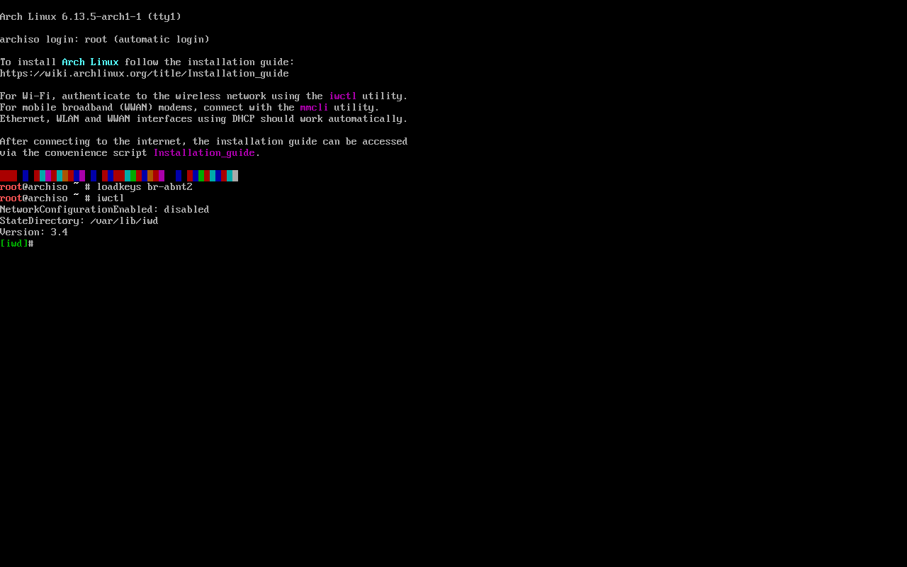
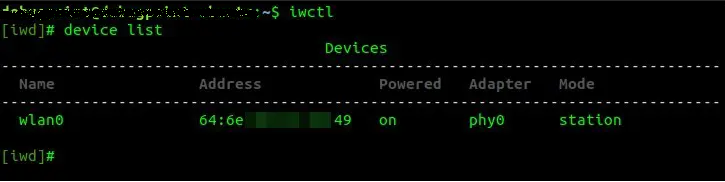
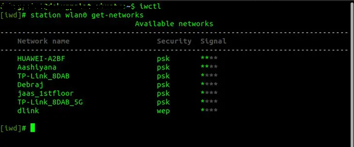
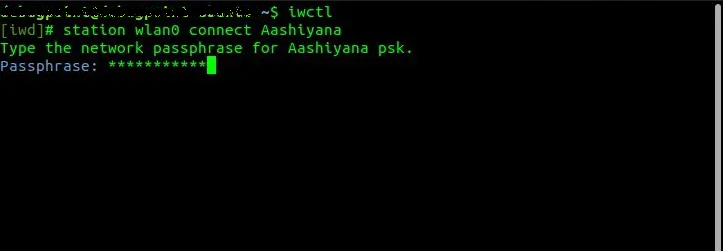

## Em Construção

#### Configuração da rede wi-fi:

Com o teclado já configurado, iremos verificar se nossa máquina está conecctada à internet. (Opcional caso esteja conectada via cabo).
Usaremos o seguinte comando:

>```
>iwctl
>```

A seguinte tela será exibida:


Utilizar o comando "device list" para listar os dispositivos de rede disponíveis.

>```
>device list
>```
Algo parecido com isso irá aparecer:


Utilizar "station nomeDoDispositivo get-networks" para listar as redes.
Exemplo: station wlan0 get-networks, para buscar redes com o wlan0.
>```
>station seuDispositivoDeRede get-networks
>```
Algo parecido com isso irá aparecer:


Após descobrir o nome do seu dispositivo de rede e o nome da sua rede wi-fi, vamos realmente conectar sua máquina no wi-fi.

Utilize o comando a seguir:

>```
>station nomeDoDispositivo connect nomeDaSuaRede
>```

Exemplo: station wlan0 connect nomeDaSuaRede, para conectar na sua rede wi-fi.

Caso tenha sido efetuado corretamente, será solicitado para você digitar o password da rede, como na tela seguinte:



#### OBS: O nome da rede tem que ser digitado exatamente como foi exibido no passo anterior, letras maiúsculas, minúsculas e símbolos.

Caso tudo tenha sido efetuado corretamente, será solicitada a senha da sua rede.
Digite o password da rede e tecle enter.
Será direcionado para a página inicial do iwd e nenhum erro será exibido.
Para sair do iwd, basta digitar exit e apertar enter.

#### Teste de conexão de rede:
Para fazer o teste, se a máquina está corretamente conectada à internet, basta fazer o test de ping.
Exemplo: ping 8.8.8.8 (DNS do Google)
Se nenhum erro for apresentado, o wi-fi foi configurado corretamente.